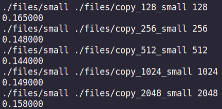
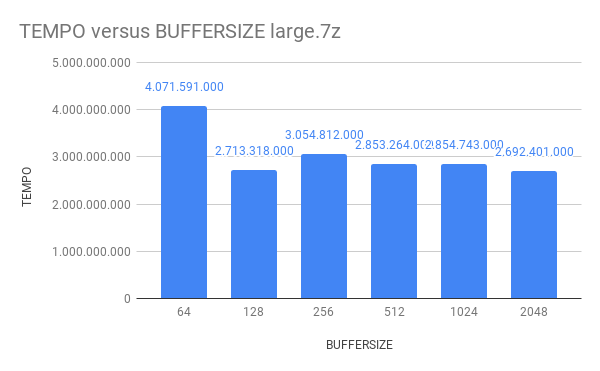
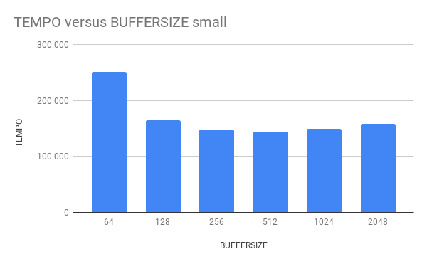

# copy
## Como compilar com gcc no linux
```shell
gcc -O3 main.c
```
## Uso
```shell
./a.out path_to_file path_to_file_to_copy buffer_size
```
## Saída
Tempo de cópia em millisegundos. Vide imagem abaixo.



## Testes

Fora realizado testes com dois arquivos usando diferentes tamnhos de buffer.

| arquivo |tamanho |
| --- | --- |
|small | 10KB
|large.7z | 892MB|




### Especificações da máquina usada nos testes
> i5-8300H
> HD 5000 RPM
> 8GB RAM 2400 Mhz
